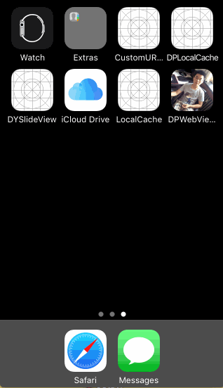

<p align="center" >

</p>

## Features

- [x] Categories for `UIWebView`, `MKWebview`, adding cache management
- [x] An asynchronous image downloader
- [x] An asynchronous memory + disk image caching with automatic cache expiration handling
- [x] A background image decompression
- [x] A guarantee that the same URL won't be downloaded several times
- [x] A guarantee that bogus URLs won't be retried again and again
- [x] A guarantee that main thread will never be blocked
- [x] Performances!
- [x] Use GCD and ARC

## Requirements
- iOS 7.0 or later
- tvOS 9.0 or later
- watchOS 2.0 or later
- OS X 10.8 or later
- Xcode 7.3 or later

## Getting Started
- Read this Readme doc
- Read the [How to use section](https://github.com/rs/DPWebViewLocalCache#how-to-use)
- Read the [documentation @ CocoaDocs](http://cocoadocs.org/docsets/DPWebViewLocalCache/)
- Try the example by downloading the project from Github or even easier using CocoaPods try `pod try DPWebViewLocalCache`
- Get to the [installation steps](https://github.com/rs/DPWebViewLocalCache#installation)

## Who Uses It
- Find out [who uses DPWebViewLocalCache](https://github.com/xiayuqingfeng/DPWebViewLocalCache/wiki/Who-Uses-SDWebImage) and add your app to the list.

## Communication
- If you **need help**, use [Stack Overflow](http://stackoverflow.com/questions/tagged/DPWebViewLocalCache). (Tag 'DPWebViewLocalCache')
- If you'd like to **ask a general question**, use [Stack Overflow](http://stackoverflow.com/questions/tagged/DPWebViewLocalCache).
- If you **found a bug**, open an issue.
- If you **have a feature request**, open an issue.
- If you **want to contribute**, submit a pull request.

## Installation

## How To Use

```objective-c
Objective-C:

#import #import <DPLocalCache.h>
...
//添加浏览器本地缓存处理
DPLocalCache *urlCache = [[DPLocalCache alloc] initWithMemoryCapacity:20 * 1024 * 1024
                                                         diskCapacity:200 * 1024 * 1024
                                                             diskPath:nil
                                                            cacheTime:60*60*24
                                                             modeTybe:DOWNLOAD_MODE
                                                         subDirectory:@"PXPT"];
urlCache.keyArray = @[@"sessionId"];
[NSURLCache setSharedURLCache:urlCache];
```
- For details about how to use the library and clear examples, see [The detailed How to use](Docs/HowToUse.md)

Installation
------------

There are three ways to use SDWebImage in your project:
- using CocoaPods
- using Carthage
- by cloning the project into your repository

### Installation with CocoaPods

[CocoaPods](http://cocoapods.org/) is a dependency manager for Objective-C, which automates and simplifies the process of using 3rd-party libraries in your projects. See the [Get Started](http://cocoapods.org/#get_started) section for more details.

#### Podfile
```
platform :ios, '7.0'
pod 'DPWebViewLocalCache', '~> 1.1.6'
```

If you are using Swift, be sure to add `use_frameworks!` and set your target to iOS 8+:
```
platform :ios, '8.0'
use_frameworks!
```

### Build Project

At this point your workspace should build without error. If you are having problem, post to the Issue and the
community can help you solve it.

## Author
- [Olivier Poitrey](https://github.com/rs)

## Collaborators
- [Konstantinos K.](https://github.com/mythodeia)
- [Bogdan Poplauschi](https://github.com/bpoplauschi)

## Licenses

All source code is licensed under the [MIT License](https://github.com/xiayuqingfeng/DPWebViewLocalCache/blob/master/LICENSE).

## Pictures show

<p align="center" >

</p>
